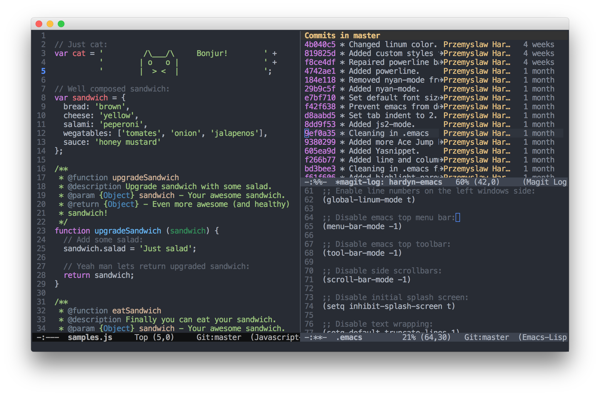

# javascript-emacs
GNU Emacs configuration for JavaScript development.

## Installation
1. Download repository.
2. Symlink or copy `./configs/.emacs` and `./configs/.emacs.d` to your home directory.

## Included packages
- redo+
- [expand-region](https://github.com/magnars/expand-region.el)
- [smex](https://github.com/nonsequitur/smex)
- [ido](https://github.com/DarwinAwardWinner/ido-ubiquitous)
- [yasnippet](http://github.com/capitaomorte/yasnippet)
- [js-doc](https://github.com/mooz/js-doc)
- [js2-mode](https://github.com/mooz/js2-mode/)
- [ac-js2](https://github.com/ScottyB/ac-js2)
- [projectile](https://github.com/bbatsov/projectile)
- [smartparens](https://github.com/Fuco1/smartparens)
- [auto-complete](https://github.com/auto-complete/auto-complete)
- [multiple-cursors](https://github.com/magnars/multiple-cursors.el)
- [magit](https://github.com/magit/magit)
- [highlight-parentheses](https://github.com/tsdh/highlight-parentheses.el)
- [yasnippet](http://github.com/capitaomorte/yasnippet)
- [nyan-mode](https://github.com/TeMPOraL/nyan-mode/)
- [hlinum](https://github.com/tom-tan/hlinum-mode/)
- syntax-subword
- [less-css-mode](https://github.com/purcell/less-css-mode)
- [undo-tree](http://www.dr-qubit.org/emacs.php)
- [helm](https://emacs-helm.github.io/helm/)
- [helm-projectile](https://github.com/bbatsov/helm-projectile)
- [scss-mode](https://github.com/antonj/scss-mode)
- [god-mode](https://github.com/chrisdone/god-mode)
- [use-package](https://github.com/jwiegley/use-package)
- [avy](https://github.com/abo-abo/avy)
- [markdown-mode](http://jblevins.org/projects/markdown-mode/)
- [php-mode](https://github.com/ejmr/php-mode)
- [smart-forward](https://github.com/magnars/smart-forward.el)
- [web-mode](https://github.com/fxbois/web-mode)

## Key bindings
- Movement
  - `Ctrl + f` - move forward
  - `Ctrl + b` - move backward
  - `Ctrl + n` -  move to next line
  - `Ctrl + p` - move to previous line
  - `Ctrl + a` - move to beginning of the line
  - `Ctrl + e` - move to ending of the line
  - `Alt + f` - move word forward
  - `Alt + b` - move word backward
  - `Alt + right arrow` - move forward (semantic)
  - `Alt + left arrow` - move backward (semantic)
  - `Alt + up arrow` - move up (semantic)
  - `Alt + down arrow` - move down (semantic)

- Selection
  - `Ctrl + space` - enter/exit text selection mode
  - `Ctrl + .` - mark next like this
  - `Ctrl + ,` - mark previous like this
  - `Ctrl + j` - new line for many cursors
  - `Alt + s` - expand selection, then by pressing `s` expand it wider
  - `Ctrl + x + p` - select all

- History and search
  - `Alt + w` - copy
  - `Ctrl + k` - cut
  - `Ctrl + y` - paste, then by pressing `y` paste previously copied text
  - `Left arrow` - undo
  - `Right arrow` - redo
  - `Ctrl + s` - search (forward)
  - `Ctrl + r` - search (backward)
  - `Ctrl + c g` - recursive grep

- Text removal
  - `Alt + backspace` - remove word backward
  - `Alt + d` - remove word forward
  - `Ctrl + d` - remove character forward

- Files and console
  - `Ctrl + c p f` - search file
  - `Alt + h` - search file (helm)
  - `Ctrl + x b` - search through open files
  - `Alt + x` - open console
  - `Ctrl + x Ctrl + f` - browse files

- Avy
  - `Ctrl + space` - go to word (two letters)
  - `Ctrl + w` - go to word (one letter)
  - `Ctrl + l` - go to line

- JavaScript
  - `f tab` - anonymous function snippet
  - `fn tab` - named function snippet
  - `i tab` - if snippet
  - `ie tab` - if else snippet
  - `Ctrl + c i` - js function description comment

- Other
  - `Alt + ;` - comment/uncomment line/selection
  - `Ctrl + x u` - open undo-tree buffer
