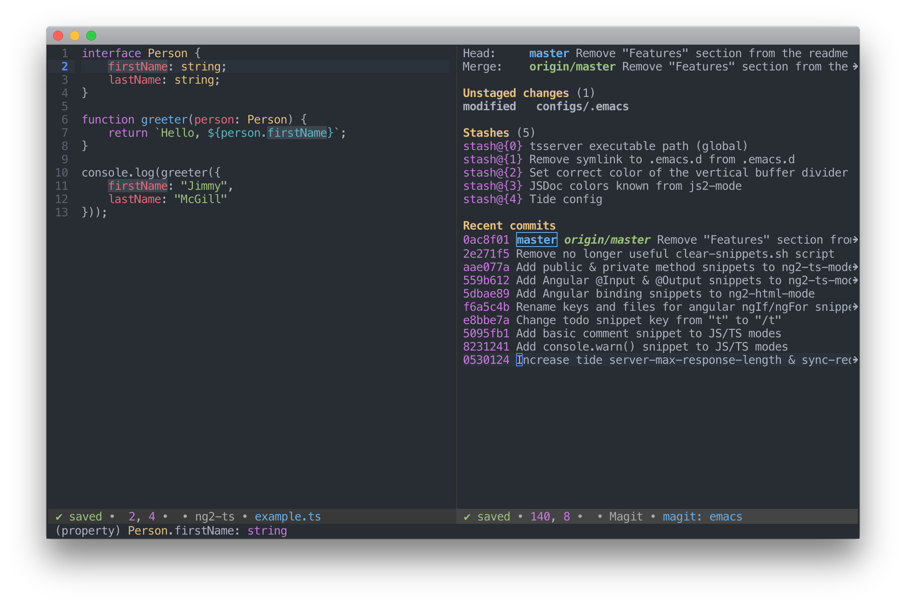

# Emacs

My personal Emacs configuration used mostly for JavaScript development.

Node.js is required for JavaScript syntax checking.

## Installation
1. Download repository.
2. Symlink or copy `./configs/.emacs` and `./configs/.emacs.d` to your home directory.
3. Install [TSlint](https://palantir.github.io/tslint/usage/cli/)

## Included packages
- redo+
- [expand-region](https://github.com/magnars/expand-region.el)
- [ido](https://github.com/DarwinAwardWinner/ido-ubiquitous)
- [yasnippet](http://github.com/capitaomorte/yasnippet)
- [js-doc](https://github.com/mooz/js-doc)
- [js2-mode](https://github.com/mooz/js2-mode/)
- [ac-js2](https://github.com/ScottyB/ac-js2)
- [projectile](https://github.com/bbatsov/projectile)
- [smartparens](https://github.com/Fuco1/smartparens)
- [auto-complete](https://github.com/auto-complete/auto-complete)
- [multiple-cursors](https://github.com/magnars/multiple-cursors.el)
- [magit](https://github.com/magit/magit)
- [yasnippet](http://github.com/capitaomorte/yasnippet)
- [nyan-mode](https://github.com/TeMPOraL/nyan-mode/)
- [hlinum](https://github.com/tom-tan/hlinum-mode/)
- syntax-subword
- [less-css-mode](https://github.com/purcell/less-css-mode)
- [undo-tree](http://www.dr-qubit.org/emacs.php)
- [helm](https://emacs-helm.github.io/helm/)
- [helm-projectile](https://github.com/bbatsov/helm-projectile)
- [scss-mode](https://github.com/antonj/scss-mode)
- [god-mode](https://github.com/chrisdone/god-mode)
- [use-package](https://github.com/jwiegley/use-package)
- [avy](https://github.com/abo-abo/avy)
- [markdown-mode](http://jblevins.org/projects/markdown-mode/)
- [php-mode](https://github.com/ejmr/php-mode)
- [smart-forward](https://github.com/magnars/smart-forward.el)
- [web-mode](https://github.com/fxbois/web-mode)
- [smooth-scroll](https://www.emacswiki.org/emacs/smooth-scroll.el)
- [csv-mode](https://github.com/emacsmirror/csv-mode)
- [column-enforce-mode](www.github.com/jordonbiondo/column-enforce-mode)
- [yaml-mode](https://github.com/yoshiki/yaml-mode)
- [clojure-mode](https://github.com/clojure-emacs/clojure-mode)
- [xkcd](https://github.com/vibhavp/emacs-xkcd)
- [jedi](https://github.com/tkf/emacs-jedi)
- [flycheck](https://github.com/flycheck/flycheck)
- [exec-path-from-shell](https://github.com/purcell/exec-path-from-shell)
- [json-mode](https://github.com/joshwnj/json-mode)
- [ztree](https://github.com/fourier/ztree)
- [typescript-mode](https://github.com/ananthakumaran/typescript.el)
- [ng2-mode](https://github.com/AdamNiederer/ng2-mode)
- [tide](https://github.com/ananthakumaran/tide)
- [company](http://company-mode.github.io/)
- [string-inflection](https://github.com/akicho8/string-inflection)

## Key bindings
- Movement
  - `Ctrl + f` - move forward
  - `Ctrl + b` - move backward
  - `Ctrl + n` -  move to next line
  - `Ctrl + p` - move to previous line
  - `Ctrl + a` - move to beginning of the line
  - `Ctrl + e` - move to ending of the line
  - `Alt + f` - move word forward
  - `Alt + b` - move word backward
  - `Alt + right arrow` - move forward (semantic)
  - `Alt + left arrow` - move backward (semantic)
  - `Alt + up arrow` - move up (semantic)
  - `Alt + down arrow` - move down (semantic)
  - `Alt + <` - move to beginning of the file
  - `Alt + >` - move to ending of the file
  - `Ctrl + v` - scroll down
  - `Alt + v` - scroll up
  - `Alt + p` - move line/region up
  - `Alt + n` - move line/region down
  - `up arrow` - jump to line with number

- Selection
  - `Ctrl + space` - enter/exit text selection mode
  - `Ctrl + .` - mark next like this
  - `Ctrl + ,` - mark previous like this
  - `Ctrl + j` - new line for many cursors
  - `Alt + s` - expand selection, then by pressing `s` expand it wider
  - `Ctrl + x + p` - select all
  - `Alt + .` - add another cursor forward/below
  - `Alt + ,` - add another cursor backward/up

- History and search
  - `Alt + w` - copy
  - `Ctrl + k` - cut
  - `Ctrl + y` - paste, then by pressing `Alt + y` paste previously copied text
  - `Left arrow` - undo
  - `Right arrow` - redo
  - `Ctrl + s` - Isearch (forward, case sensitive)
  - `Ctrl + r` - Isearch (backward, case sensitive)
  - `Alt + c` - switch to case insensitive Isearch
  - `Alt + g` - recursive grep

- Text removal
  - `Alt + backspace` - remove word backward
  - `Alt + d` - remove word forward
  - `Ctrl + d` - remove character forward

- Files and console
  - `Ctrl + c p f` - search file
  - `Ctrl + l` - search file (helm)
  - `Alt + l` - search buffer (helm)
  - `Alt + x` - search command (helm)
  - `Ctrl + x b` - search through open files
  - `Alt + x` - open console
  - `Ctrl + x Ctrl + f` - browse files
  - `Ctrl + r` - next
  - `Ctrl + s` - previous

- Avy
  - `Ctrl + space` - go to word (two letters)
  - `Ctrl + w` - go to word (one letter)
  - `Ctrl + l` - go to line

- JavaScript
  - `f tab` - anonymous function snippet
  - `fn tab` - named function snippet
  - `i tab` - if snippet
  - `ie tab` - if else snippet
  - `Ctrl + c i` - js function description comment

- Windows
  - `Ctrl + x 3` - split screen vertically
  - `Ctrl + x 2` - split screen horizontally
  - `Ctrl + x o` - move to next window
  - `Ctrl + x 0` - close window
  - `Ctrl + x Ctrl + o` - rotate buffer windows

- Helm buffer list
  - `Alt + l` - open list
  - `Ctrl + Space` - mark buffers on the list
  - `Alt + Shift + d` - kill marked buffers and close Helm

- TypeScript/Angular
  - `Ctrl + c Ctrl + c` - open component counterpart
  - `Ctrl + c j` - jump to html binding (inside a template)
  - `Ctrl + c j` - jump to definition (inside a TypeScript file)
  - `Ctrl + c r s` - rename symbol
  - `Ctrl + c r f` - rename file

- Bookmarks
  - `Ctrl + c b l` - open list of bookmarks
  - `Ctrl + c b a` - add a bookmark
  - `Ctrl + c b d` - delete a bookmark
  - `Ctrl + c b r` - rename a bookmark

- Other
  - `Alt + ;` - comment/uncomment line/selection
  - `Ctrl + x u` - open undo-tree buffer
  - `Alt + m` - open magit status buffer
  - `down arrow` - count lines, words and characters
  - `Ctrl + c Ctrl + s` - cycle between different ways of writing strings (camelCase, kebab_case etc.)
  - `Alt + r` - open rgrep

## Credits
Great thanks to Andrzej for showing me emacs, what made me immediately hooked.
